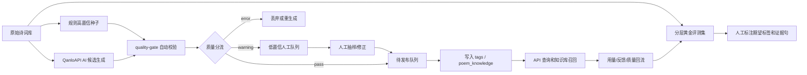
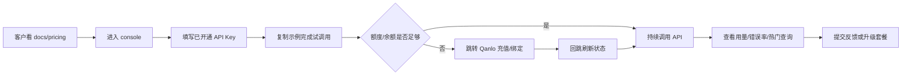
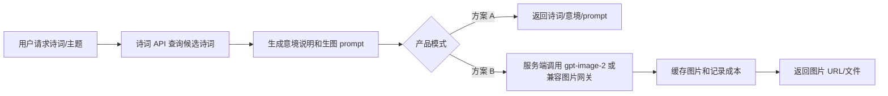

# AI 诗词知识库 API 增强版开发规划

> 长期产品终极形态与分阶段路线图见：[诗词画曲赋：终极产品形态与长期迭代路线图](ultimate-product-roadmap.md)。本路线图作为 v2+ 长期产品蓝本，当前 v1.x 仍以 API、计费、控制台、数据质量稳定为优先。


> 版本：v1.6 终局收口版（2026-06-30）  
> 本文档是当前产品与开发主规划，也是后续执行的唯一总路线。后续不再每轮临时追加“下一步建议”；只按本文档的终极形态、固定路线和停止线继续推进。

## 0. 当前结论

这次把计费链路修正为：**只保留 QanloAPI 入口，不再接其他大模型入口，不优先自建复杂支付/订阅系统**。

### 0.1 2026-06-30 数据增强生产策略修正

`rules-v13` 在 `offset1000` 最新抽检里没有达到规模化上线标准：输入 100 首，只生成 32 条；人工审查 21 条可接受、4 条需修正、7 条错误拒绝，合格/可修正 25/32，通过率 78.13%。结论是：**停止把规则小批抽检当成 40 万首主生产路线**。

后续阶段 4 改成这条路线：

1. 规则只产出高置信种子数据，宁可少发，不乱发。
2. 先建立 1000-2000 条黄金评测集，按诗/词/曲、朝代、标签类型分层抽样。
3. 主生产改为 QanloAPI AI 候选生成：标签、解释、检索字段都先进入候选队列。
4. 候选先跑自动校验：原文证据、过度解读、格式合规、低置信提示。
5. 人工只做低置信、失败样本和每批 0.5%-2% 抽样质检，不逐条检查 40 万首。

停止线：任一规则批次低于 90%，不再继续规则扩批；只保留人工 accept/correct 证据，低置信进入人工队列。

我认为这比之前“自己做账户、工作区、余额、订阅、支付全套链路”更符合当前商业场景，原因很直接：

1. **成交路径更短**：客户拿到管理员或 Qanlo 开通链路发放的 API Key 后，直接跳 Qanlo 精简充值页，充值回来就能用。
2. **开发成本更低**：先复用 Qanlo 的充值、余额、支付链路，不提前自建 Stripe/支付宝/订阅中心。
3. **支持成本更低**：客户只认一个充值入口、一个 Key 入口，不用理解多个模型供应商。
4. **商业闭环更快**：可以先验证“诗词知识库 API 是否有人愿意付费”，而不是先耗在支付后台。
5. **产品边界更清楚**：我们卖的是诗词数据、检索能力、标签质量和知识库 API；Qanlo 负责充值入口与模型/API 消费链路。
6. **长期仍可扩展**：后续收入稳定后，再补完整客户后台、套餐、发票、合同、私有部署，不影响当前方向。

### 0.2 项目最终形态

本项目最终不是“规则脚本集合”、不是“开源诗词数据库镜像”、也不是“通用大模型网关”。最终形态固定为：

> **可收费、可接入、可运营、可持续增强的 AI 诗词知识库 API 平台。**

终局产品由六块组成：

| 模块 | 最终形态 | 不做什么 |
| --- | --- | --- |
| 数据资产 | 原始诗词库 + 已审核标签 + 译文/注释/推荐理由 + 证据句 + 质量状态 | 不发布无证据、无审核口径的低置信标签 |
| 检索 API | 结构化查询、全文搜索、标签召回、知识库召回、批量接口、OpenAPI 规格 | 不把接口做成只适合内部脚本调用的半成品 |
| AI 知识层 | QanloAPI 生成候选，自动校验，人工抽样质检，逐批发布高置信数据 | 不再把 rules-v14/v15 这类规则补丁当 40 万首主生产路线 |
| 可选生图层 | 默认先返回诗词意境与生图 prompt；有真实需求后再由服务端内部接入 `gpt-image-2` 生成图片 | 不把用户访问诗词 API 的 Key 直接拿去调生图模型；不在未确认成本和网关能力前默认开启生图 |
| 商业闭环 | API Key、Qanlo 绑定/充值、用量统计、限额、价格页、客户控制台 | 第一阶段不自建复杂支付、订阅、优惠券和多工作区 SaaS |
| 运营后台 | Key 管理、用量、错误率、热门查询、抽检队列、回滚、风控、备份恢复 | 不让运营人员靠直接改 SQLite 表维持产品 |
| 开发者交付 | `/docs`、`/console`、`/pricing`、示例代码、OpenAPI、smoke 验证 | 不交付“能跑但客户不会接”的接口 |

### 0.3 终局验收标准

只有同时满足下面条件，才算项目进入可长期收费状态：

1. **客户接入闭环**：新客户能从文档进入，创建 Key，试调用，看到结果，余额/额度不足时进入 Qanlo 充值，回跳后继续调用。
2. **API 产品闭环**：结构化查询、全文搜索、标签召回、知识库召回、批量接口、OpenAPI 和示例代码都可用。
3. **数据质量闭环**：已发布增强数据必须能追溯来源、候选批次、质量状态、抽检结果和回滚路径。
4. **AI 生产闭环**：黄金评测集、QanloAPI 候选生成、`quality-gate`、人工抽样质检、发布队列形成固定流水线。
5. **运营闭环**：管理员能看 Key、用量、错误率、热门查询、反馈、封禁、备份和恢复，不依赖临时 SQL。
6. **商业验证闭环**：至少 3-5 个真实开发者/内容工具完成试用记录，其中有人完成充值或明确付费意向。
7. **稳定性交付**：本地验证、smoke、备份恢复、关键契约测试跑通后再考虑部署/CI，不烧无效 GitHub Actions 额度。

逐项状态和证据统一维护在 [final-acceptance-checklist.md](final-acceptance-checklist.md)。后续停工判断以该清单全部达到 `DONE` 为准。

### 0.4 后续执行口径

从 v1.6 起，后续工作只按本文档第 7 节“终极执行总路线”和 `scripts/final_closeout.ps1` 推进。以后不再每轮临时追加“下一步建议”；机器判断统一看 `data/acceptance/final-closeout-report.json` 和 `data/acceptance/final-acceptance-audit.json`。

固定口径：

1. `ready_for_stop=true`：项目达到最终形态，可以停工。
2. `ready_for_stop=false`：只处理报告里的 `blockers`，不改方向、不另起路线。
3. 真实人工复核、真实 Qanlo 调用、真实商业试用这三类外部证据，脚本只做门禁，不伪造结果。

### 0.5 可选生图能力边界

生图能力纳入最终形态的**可选扩展**，但不改变当前主线：第一阶段先把诗词知识库 API、计费链路、数据质量流水线和商业验证跑通。

固定采用两级方案：

| 方案 | 产品形态 | 技术要求 | 执行口径 |
| --- | --- | --- | --- |
| 方案 A：API 只返回诗词和 prompt | `唐诗宋词API -> 返回诗词/意境/prompt -> Codex、前端或客户自己的系统再调用 gpt-image-2 生图` | 本项目只需要文本能力；可由规则模板或 QanloAPI 生成稳定 prompt | **优先方案**。先做成低成本增值字段，不消耗本项目服务器生图额度 |
| 方案 B：API 直接返回图片 | `用户请求 -> 唐诗宋词API -> 查诗 -> 生成 prompt -> 调用 gpt-image-2 -> 返回图片` | 服务端必须配置支持图片生成接口的内部 Key/网关，如 `IMAGE_API_KEY`、`IMAGE_BASE_URL`、`IMAGE_MODEL=gpt-image-2` | **后置方案**。等有明确客户需求、成本边界和网关验证后再执行 |

必须分开两套 Key：

1. **用户访问诗词 API 的 Key**：只负责鉴权、限流、计费、统计和风控。
2. **服务器内部调用模型/生图模型的 Key**：只由服务端持有，用来调用 `gpt-image-2` 或兼容图片生成网关。

固定规则：

- 不把用户的诗词 API Key 直接拿去调模型或生图接口。
- 当前 `agent_model` 偏文本/知识召回，不能当成图片生成模型使用。
- 未配置并验证 `IMAGE_API_KEY`、`IMAGE_BASE_URL`、`IMAGE_MODEL` 前，接口不得承诺“直接返回图片”。
- 方案 A 的 prompt 字段可以先进入 API/文档/示例；方案 B 只进入待执行队列，不阻塞当前最终验收。

---

## 1. 已确认决策

1. **目标覆盖**：长期覆盖 AI 知识库、教育 App、小程序、内容工具、机构私有知识库等场景；第一阶段先做 AI 知识库。
2. **收费方式**：优先按 API 调用收费；计费/充值链路参考本地项目：`命理智能体`、`企业经营决策智能体`、`qimendunjia`。
3. **计费入口**：只保留 QanloAPI 入口；不再接 OpenAI、Claude、DeepSeek、硅基流动等多个大模型入口。
4. **充值链路**：客户端/控制台填写已开通 API Key -> 跳转 Qanlo 精简充值页 -> 充值完成回到客户端/控制台 -> 立即可调用。
5. **开源策略**：增强版先不开源，等赚到钱、边界更清楚后再决定开源哪些模块。
6. **交付形态**：要有完整后台和文档站，不只是 API 接口。
7. **数据增强**：AI 批量生成标签、解释、主题、场景等数据，再由人工抽检。
8. **产品节奏**：按长期产品打磨，不做一次性 demo。

---

## 2. 最终目标

把原始古诗词 API 升级为一个可长期收费的 **AI 诗词知识库 API 平台**。

它要提供四层价值：

| 层级 | 能力 | 客户价值 |
| --- | --- | --- |
| 数据层 | 诗、词、作者、朝代、体裁、正文 | 比自己清洗数据省时间 |
| 检索层 | 复合查询、全文搜索、标签搜索、后续语义召回 | 比原始 API 更好用 |
| 知识层 | 标签、主题、情绪、场景、注释、译文、推荐理由 | 适合 AI/RAG/教育/内容生成 |
| 商业层 | API Key、调用统计、Qanlo 充值、后台、文档站 | 能收费、能运营、能长期维护 |

一句话目标：

> 让开发者和内容产品可以用一套稳定 API，把诗词数据接入 AI 应用、教育产品和内容生成工具，并通过 QanloAPI 链路按调用量付费。

---

## 3. 第一阶段业务场景：AI 知识库

### 3.1 典型客户

- AI 助手/智能体开发者：需要诗词知识召回、引用、解释、推荐。
- 教育类应用：需要按年级、主题、考试场景找诗词。
- 内容生成工具：需要按节日、情绪、短视频文案、文旅场景找诗句。
- 企业/机构知识库：需要私有部署或稳定 API 接入。

### 3.2 核心使用流程


### 3.3 AI 知识库 API 应提供的能力

| 能力 | 说明 | 优先级 |
| --- | --- | --- |
| 结构化查询 | 朝代、作者、体裁、标签、字数、句数组合筛选 | P0 |
| 全文搜索 | 标题、作者、正文搜索，返回命中结果 | P0 |
| 标签召回 | 思乡、送别、月亮、边塞、节日、文旅等 | P0 |
| API Key 鉴权 | 每个客户独立 Key，支持启用/禁用/限额 | P0 |
| 调用统计 | 记录调用次数、Key、接口、耗时、状态码 | P0 |
| Qanlo 充值入口 | 余额不足时跳 Qanlo 精简充值页 | P0 |
| 知识上下文 | 返回注释、译文、标签、推荐引用格式 | P1 |
| 批量接口 | 批量查询、批量召回、批量导出 | P1 |
| 意境/prompt 生成 | 为诗词、主题、节日、文旅和内容场景返回可用于生图或视频分镜的稳定 prompt | P2 |
| 语义召回 | 自然语言找诗，如“适合毕业离别的诗” | P2 |
| 诗词生图 API | 服务端内部调用 `gpt-image-2` 或兼容图片网关，直接返回图片 URL/文件；需要单独成本控制 | P3 可选 |
| 私有知识库 | 企业客户私有部署、定制标签、SLA | P3 |

---

## 4. QanloAPI 商业链路设计

### 4.1 参考项目

本项目计费链路不再参考通用 Qanlo Code 平台的复杂工作区/订阅形态，优先参考以下本地项目已经跑过的链路：

| 项目 | 可参考点 |
| --- | --- |
| `G:\项目\命理智能体` | 客户端固定 Qanlo provider、创建/保存 Qanlo Agent Key、精简充值页、充值 callback |
| `G:\项目\企业经营决策智能体` | 后端生成 Qanlo connect/recharge URL、callback 保存 Key、前端触发 provision/recharge |
| `G:\项目\qimendunjia` | 只暴露用户侧 Qanlo Agent Key，不把 App Secret 打进客户端，模型分组由 Qanlo 后台控制 |

### 4.2 必须坚持的产品规则

1. **只保留 QanloAPI**：配置和界面里不再给客户选择其他大模型供应商。
2. **不暴露 App Secret**：客户端只保存用户自己的 Qanlo Agent Key；服务端/配置中心保管敏感参数。
3. **模型由 Qanlo 后台控制**：客户端不需要知道真实底层模型，后续切模型不影响客户。
4. **充值走精简页**：余额不足或客户主动充值时，直接打开 Qanlo compact recharge 页面。
5. **回调后立即可用**：充值或绑定成功后，回到控制台/客户端刷新状态即可继续调用。
6. **本项目保留调用审计**：我们仍然记录 API 调用量、Key 状态、接口耗时、错误率和热门查询，用于运营和风控。

### 4.3 推荐接口链路

| 接口 | 用途 | 阶段 |
| --- | --- | --- |
| `POST /api/v1/keys` | 兼容路由；公开自助创建已禁用，默认返回 403，避免未充值用户生成可用 Key | 已调整 |
| `GET /api/v1/keys/current` | 客户端查看当前 Key 状态、额度和今日用量 | 已实现 |
| `GET /api/v1/admin/api-keys` | 管理员查看客户 Key 列表、状态、额度/用量 | 已实现 |
| `POST /api/v1/billing/qanlo/provision` | 创建/绑定 Qanlo Agent Key，返回 connect_url 或绑定结果 | 已实现 |
| `GET /api/v1/billing/qanlo/callback` | Qanlo 回跳后保存/刷新绑定状态 | 已实现 |
| `POST /api/v1/billing/qanlo/recharge-session` | 返回 Qanlo 精简充值页 URL | 已实现 |
| `GET /api/v1/billing/status` | 查询当前 Key 是否可用、额度、用量和 Qanlo 绑定状态 | 已实现 |
| `GET /api/v1/knowledge/scenarios` | 查看内置热门知识库场景 | 已实现 |
| `GET /api/v1/knowledge/recall` | 按自然语言意图召回诗词知识上下文 | 已实现 |
| `POST /api/v1/knowledge/batch` | 批量召回多组知识库结果 | 已实现 |
| `GET /api/v1/usage/daily` | 查看当前 Key 每日调用量聚合，支持运营看趋势 | 已实现 |
| `GET /api/v1/usage/endpoints` | 查看当前 Key 各接口调用量、错误数和错误率聚合 | 已实现 |
| `GET /api/v1/usage/queries` | 查看当前 Key 热门查询摘要 | 已实现 |
| `GET /api/v1/admin/usage/daily` | 管理员查看全站或指定 Key 的每日用量聚合 | 已实现 |
| `GET /api/v1/admin/usage/endpoints` | 管理员查看全站或指定 Key 的接口调用量、错误率和耗时 | 已实现 |
| `GET /api/v1/admin/usage/queries` | 管理员查看全站或指定 Key 热门查询摘要 | 已实现 |

### 4.4 计费边界

第一阶段先做：

- API Key 创建、禁用、用量统计。
- Qanlo Agent Key 创建/绑定。
- Qanlo 精简充值跳转。
- 充值回调后的状态刷新。
- 控制台展示 Key、用量、充值入口。

第一阶段不做：

- 自建 Stripe/支付宝/微信支付收银台。
- 复杂订阅、优惠券、分销、发票自动化。
- 多供应商模型选择界面。
- 多工作区、多成员权限的完整 SaaS 账户体系。

---

## 5. 当前代码状态

当前仓库已经完成了一个可继续商业化的底座雏形：

| 模块 | 状态 | 说明 |
| --- | --- | --- |
| 复合查询 API | 已实现 | `GET /api/v1/poems/query`，支持作者、朝代、体裁、标签、字数、句数、关键词组合查询 |
| API Key 鉴权 | 已实现 | 公开自助创建已禁用；支持管理员创建/列表/吊销、启停、备注、每日限额调整、请求中间件、今日用量统计 |
| 标签系统 | 已实现雏形 | 支持标签表、诗词标签关联、按标签筛选；标签质量后续靠 AI 增强和人工抽检提升 |
| 全文搜索 | 已实现雏形 | SQLite FTS5 可选构建，支持标题/作者/正文搜索 |
| 基础文档 | 已有雏形 | README、商业 API Key、复合查询、全文搜索、标签、示例代码已补充 |
| QanloAPI 计费链路 | 已实现 MVP | 已接入 provision/recharge/callback/status，只保留 QanloAPI 精简链路 |
| 最小控制台 | 已实现 MVP | `/console` 支持填写已开通 Key、跳转绑定/充值、刷新状态、试调用、客户 Key 状态查看、AI 抽检、用量趋势、接口错误率和热门查询；不再公开自助创建免费 Key |
| 文档站 | 已实现雏形 | `/docs` 已可访问，已补 usage、AI 数据增强、商业接入说明；后续继续打磨成完整开发者文档站 |
| AI 知识库召回 | 已实现 MVP | 已有 `/knowledge/scenarios`、`/knowledge/recall`、`/knowledge/batch`，支持规则场景、标签、关键词召回 |
| AI 数据增强 | 已实现 MVP，生产路线已修正 | 已有 `cmd/enrichment`、一键试跑脚本、待审表、人工通过/退回/修正、人工抽检样本导出、抽检结果写回、抽检报告、批次/单诗回滚；`rules-v13 offset1000` 最新抽检通过率 78.13%，不能作为 40 万首主生产路线；下一步改为规则高置信种子 + 黄金评测集 + QanloAPI AI 候选 + 自动校验 + 抽样质检；当前可发布增强数据先按 365 条证据口径保守发布 |

---

## 6. 阶段规划

### 阶段 0：规划对齐与商业链路定稿

目标：把方向从“泛 SaaS 支付平台”收敛到“QanloAPI 精简商业闭环”。

任务：

- [x] 明确第一场景：AI 诗词知识库。
- [x] 明确增强版暂不开源。
- [x] 明确只保留 QanloAPI 入口。
- [x] 明确充值链路：填写已开通 API Key -> Qanlo 精简充值 -> 回跳 -> 可用。
- [x] 修正开发规划文档。

验收：

- 文档里不再把自建支付/多模型供应商作为第一优先级。
- 后续开发以本文档为准。

### 阶段 1：稳定当前 API MVP

目标：先把已经做出的复合查询、API Key、标签、全文搜索稳定下来。

任务：

- [x] 补齐商业接口主要错误码和返回格式；普通兼容接口后续继续统一。
- [x] 为 API Key 中间件补充边界测试。
- [x] 明确人工体验/试用 Key 默认限额：`API_DEFAULT_DAILY_LIMIT`。
- [x] 明确生产配置示例：`.env.example`、`config.yaml`。
- [x] 补充 Docker 运行说明。
- [x] 补充最小 SDK/调用示例：`examples/curl`、`examples/python`、`examples/javascript`。
- [x] 增加本地一键验证脚本：`scripts/test_local.ps1` 自动检测 CGO/gcc，必要时用 Docker 跑 `go build`、普通测试和 FTS5 测试。
- [x] 增加 CI 验收：`.github/workflows/test.yml` 覆盖普通测试、FTS5 测试和 Docker 镜像构建。

验收：

- `go test ./...` 通过；Windows 本地 CGO 不可用时可执行 `scripts/test_local.ps1` 自动切到 Docker。
- `go test -tags sqlite_fts5 ./...` 通过；Windows 本地 CGO 不可用时可执行 `scripts/test_local.ps1` 自动切到 Docker。
- Docker 镜像可构建。
- README 能让新客户 10 分钟内跑通一次查询。
- 商业路由、内置页面和文档接口清单有契约测试防止漂移。

### 阶段 2：接入 QanloAPI 精简计费链路

目标：完成商业闭环最关键的一步：客户拿到已开通 Key、充值、返回后直接调用。

任务：

- [x] 增加 Qanlo 配置：`QANLO_AGENT_BASE_URL`、`QANLO_RECHARGE_URL`、`QANLO_AGENT_APP_ID`、`QANLO_AGENT_NAME`、`QANLO_RETURN_URL`。
- [x] 增加 Qanlo client：生成 connect/recharge URL、处理 callback、刷新 Key 状态。
- [x] 增加接口：`/api/v1/billing/qanlo/provision`。
- [x] 增加接口：`/api/v1/billing/qanlo/recharge-session`。
- [x] 增加接口：`/api/v1/billing/qanlo/callback`。
- [x] 增加接口：`/api/v1/billing/status`。
- [x] 保留公开 Key 路由但禁用客户端自助创建：`POST /api/v1/keys` 返回 403，Key 改由管理员或 Qanlo 开通链路发放。
- [x] 控制台/客户端前端按钮：填写已开通 Key、充值、刷新状态。
- [x] 余额不足或限额不足时，返回明确错误和充值 URL。

验收：

- 新客户从 0 到可调用的路径能跑通。
- 充值后回到控制台能看到状态变化。
- 客户不需要配置其他模型供应商。
- 敏感密钥不出现在前端包或公开文档中。

当前状态：阶段 2 已完成 MVP；阶段 3 已完成 MVP；阶段 4 已完成可执行闭环。旧规则首批抽检通过率只有 50%，已回滚旧规则通过项；`rules-v3` 100 条全量人工检查已写回，91 条通过、9 条退回、0 条待审，通过率 91%。之后连续按 100 首小批推进：`rules-v4` offset100 82.98%，`rules-v5` offset200 75.68%，`rules-v6` offset300 97.44%，`rules-v7` offset400 78.79%，`rules-v8` offset500 87.50%，`rules-v9` offset600 63.27%，`rules-v10` offset700 53.13%，`rules-v11` offset800 62.86%，`rules-v12` offset900 72.73%，除 offset300 外均低于 90% 扩批线，说明元曲对白、典故、比喻和剧情语境仍需小批迭代。当前已把 offset900 新退回原因升级进 `rules-v13`，回放 offset900 生成 24 条、跳过 76 条，24 条人工通过/修正样本全部保留，9 条退回样本未再生成，标签 24/24 对齐。当前可发布增强数据 365 条。真实 Qanlo 小样本已用 `deepseek-v4-flash` 跑通 20 条，validate 0 error，quality-gate 0 error，20 条已人工 conservative correct 并写回发布队列。

### 阶段 3：AI 知识库核心能力

目标：让 API 不只是“能查数据库”，而是能作为 AI 知识库使用。

任务：

- [x] 定义统一返回结构：诗词正文、作者、朝代、标签、推荐引用格式。
- [x] 增加知识库召回接口：按自然语言意图映射到查询条件。
- [x] 增加热门场景接口：节日、情绪、文旅、教育、短视频文案。
- [x] 增加批量查询接口。
- [x] 设计后续向量检索数据表，但不急着大规模上线。

验收：

- 能回答“找适合毕业离别的诗”“找中秋月亮诗句”这类需求。
- 返回结果适合直接喂给 AI/RAG，而不只是原始数据库字段。

### 阶段 4：AI 批量数据增强 + 人工抽检

目标：做出真正能收费的数据差异化。

任务：

- [x] 设计标签体系：主题、情绪、场景、年级、节日、文旅、表达方式。
- [x] 设计 AI 批量生成脚本。
- [x] 设计抽检后台：待抽检、通过、退回、修正。
- [x] 建立质量标准：准确性、可解释性、避免过度脑补。
- [x] 补充阶段 4 数据增强运营文档：小样本流程、抽检标准、抽检报告、回滚策略、500-1000 首试跑。
- [x] 增加一键试跑脚本：`scripts/enrichment_trial.ps1` 可自动导出样本、生成候选、校验、导入待审队列并输出抽检报告。
- [x] 已用真实 `poetry-data` 生成 `data/poetry.db`，并完成规则增强 100 首试跑：`run_id=enrich-20260630-rules100`。
- [x] 已继续完成规则增强 500 首和 400 首分批试跑，合计 1000 条待审候选：`enrich-20260630-rules100`、`enrich-20260630-rules500-offset100`、`enrich-20260630-rules400-offset600`。
- [x] 增加 `sample-review` 人工抽检样本导出命令，避免运营直接面对整批 JSON/数据库。
- [x] 增加 `apply-review` 抽检结果写回命令，支持 dry-run 校验后批量写回 `accept/reject/correct`。
- [x] 已完成旧规则首批 20 条人工抽检写回：`enrich-20260630-rules100` 原结果为 10 条通过、10 条退回，通过率 50%；通过项已因规则质量不足回滚，报告见 `data/enrichment/review-report-enrich-20260630-rules100-first20.json` 和 `data/enrichment/review-report-enrich-20260630-rules100-after-rollback.json`。
- [x] 已根据退回原因收紧规则到 `rules-v3`：重点降低 `山水`、`文旅`、`边塞`、`送别`、`春梦误判春天`、`离愁误判送别` 等误召回，并补真实退回样本回归测试。
- [x] 已完成 `rules-v3` 100 首复测批次全量人工检查：`enrich-20260630-rules100-v3` 共 100 条，91 条通过、9 条退回、0 条待审，通过率 91%；报告见 `data/enrichment/review-report-enrich-20260630-rules100-v3-final.json` 和 `data/enrichment/review-report-enrich-20260630-rules100-v3.json`。
- [x] `rules-v3` 100 首已做 100% 人工检查，已按 [data-enrichment.md](data-enrichment.md) 记录通过率和退回原因 Top10；旧 500/400 规则候选先不发布。
- [x] 已升级到 `rules-v4`：去掉无具体安全标签时的 `经典引用` 兜底，补充低信号样本回归测试，并重建 `enrich-20260630-rules100-offset100-v4` 小批候选，47 条进入待审、53 条跳过；47 条已全量人工检查，39 条通过、8 条退回，通过率 82.98%。
- [x] 已根据 `rules-v4` 新退回原因继续升级到 `rules-v5`：收紧青春/春天、风月/月亮、嫦娥/月亮、折柳/送别、香茶/送别、身体比喻/春天等误判，并补回归测试。
- [x] 已用 `rules-v5` 跑 offset200 新小批：导出 100 首、生成并导入 37 条、跳过 63 条；37 条全量人工检查后 28 条通过、9 条退回，通过率 75.68%，低于扩批线。
- [x] 已根据 offset200 新退回原因升级到 `rules-v6`：收紧曲牌名误判春天、飞絮/春风/春色身体或气氛比喻、春山秋水眉眼比喻、千山万水阻隔套语、白马将军剧情误判边塞、月圆云遮套语、无情泛词误判相思等；`rules-v6` 回放 offset200 生成 28 条、跳过 72 条，已与人工通过结果 28/28 对齐。
- [x] 已用 `rules-v6` 跑 offset300 正式小批：导出 100 首、生成并导入 39 条、跳过 61 条；39 条全量人工检查后 38 条通过、1 条退回，通过率 97.44%。
- [x] 已根据 offset300 新退回原因升级到 `rules-v7`：收紧标题误判相思、故国怀古误判思乡、别后泛词误判送别、武陵溪畔/万山烟水/愁山闷海误判山水等；`rules-v7` 回放 offset300 生成 38 条、跳过 62 条，已与人工通过结果 38/38 对齐。
- [x] 已用 `rules-v7` 跑 offset400 正式小批：导出 100 首、生成并导入 33 条、跳过 67 条；33 条全量人工检查后 26 条通过、7 条退回，通过率 78.79%，低于扩批线。
- [x] 已根据 offset400 新退回原因升级到 `rules-v8`：收紧标题征夫误判边塞、水底捞明月/弓弯秋月误判月亮、春风翡翠巢/芳草封高冢误判春天、战场夸饰误判山水、哀告问答误判愁绪等；`rules-v8` 回放 offset400 生成 26 条、跳过 74 条，已与人工通过结果 26/26 对齐。
- [x] 已用 `rules-v8` 跑 offset500 正式小批：导出 100 首、生成并导入 56 条、跳过 44 条；56 条全量人工检查后 49 条通过/修正、7 条退回，通过率 87.50%，低于扩批线。
- [x] 已修正 `apply-review` 的 `correct` 写回语义：人工修正后直接发布为已通过，不再残留在 `pending`。
- [x] 已根据 offset500 新退回原因升级到 `rules-v9`：收紧 `山寿` 人名、`百座连城/黄河` 婚姻阻隔比喻、`成姻眷`、寻梅倦客、歌楼酒力、报恩患难、山河泛词等误判；`rules-v9` 回放 offset500 生成 49 条、跳过 51 条，49 条人工通过/修正样本全部保留，7 条退回样本未再生成，标签 49/49 对齐。
- [x] 已用 `rules-v9` 跑 offset600 正式小批：导出 100 首、生成并导入 49 条、跳过 51 条；49 条全量人工检查后 31 条通过/修正、18 条退回，通过率 63.27%，低于扩批线。
- [x] 已根据 offset600 新退回原因升级到 `rules-v10`：收紧元曲标题/场所误判山水、寿颂典故误判山水文旅、风月/青楼语境误判春天相思、山河易改/山呼/昭君出塞等成语典故误判；`rules-v10` 回放 offset600 生成 31 条、跳过 69 条，31 条人工通过/修正样本全部保留，18 条退回样本未再生成，标签 31/31 对齐。
- [x] 已用 `rules-v10` 跑 offset700 正式小批：导出 100 首、生成并导入 32 条、跳过 68 条；32 条全量人工检查后 17 条通过/修正、15 条退回，通过率 53.13%，低于扩批线。
- [x] 已根据 offset700 新退回原因升级到 `rules-v11`：收紧元曲风月/青楼语境误判宴乐歌舞/相思、押送囚系或多年离别误判送别、科举月中丹桂误判月亮、地点推进/典故人名误判山水、剧情对白小恨/哭倒长城误判愁绪等；`rules-v11` 回放 offset700 生成 17 条、跳过 83 条，17 条人工通过/修正样本全部保留，15 条退回样本未再生成，标签 17/17 对齐。
- [x] 已用 `rules-v11` 跑 offset800 正式小批：导出 100 首、生成并导入 35 条、跳过 65 条；35 条全量人工检查后 22 条通过/修正、13 条退回，通过率 62.86%，低于扩批线。
- [x] 已根据 offset800 新退回原因升级到 `rules-v12`：收紧淮河渡翻船剧情误判山水、婵娟/秋月比喻误判月亮、射柳/出塞图/军马剧情误判边塞、春风/春山春水套语误判春天山水、官场酬酢或对白误判宴乐歌舞等；`rules-v12` 回放 offset800 生成 22 条、跳过 78 条，22 条人工通过/修正样本全部保留，13 条退回样本未再生成，标签 22/22 对齐。
- [x] 已用 `rules-v12` 跑 offset900 正式小批：导出 100 首、生成并导入 33 条、跳过 67 条；33 条全量人工检查后 24 条通过/修正、9 条退回，通过率 72.73%，低于扩批线。
- [x] 已根据 offset900 新退回原因升级到 `rules-v13`：收紧煮海/山海恩/宗教神怪/军旅追击等误判山水，水族将军误判边塞，清风明月琴曲误判月亮，父母挽留误判相思，否定愁绪等；`rules-v13` 回放 offset900 生成 24 条、跳过 76 条，24 条人工通过/修正样本全部保留，9 条退回样本未再生成，标签 24/24 对齐。
- [x] `rules-v13 offset1000` 最新批次已完成人工审查证据收口：输入 100 首，规则生成 32 条；21 条可接受、4 条需修正、7 条错误拒绝，合格/可修正 25/32，通过率 78.13%。结论：停止继续盲目推进 `rules-v14`，规则只保留高置信种子。
- [x] 新增 `review-audit`：先把人工审查 JSONL 汇总成证据报告，不写库。
- [x] 新增 `export-golden-sample`：按朝代/体裁分层导出黄金评测集，后续先标注 1000-2000 条。
- [x] 新增 `golden-audit` / `golden-prefill` / `golden-review-queue` / `golden-review-sheet` / `golden-review-sheet-audit` / `golden-apply-review` / `golden-apply-review-sheet` / `golden-to-sample`：黄金集可审计、可预填、可导出 JSONL 或 CSV 复核队列、可审计人工 CSV 是否全部完成、可合并人工复核结果，并可转成普通 sample 给候选生成和 `quality-gate` 使用。
- [x] 新增 `scripts/golden_review_closeout.ps1`：人工复核 CSV 后一键审计、合并、重跑黄金集审计；未全部 `done` 时会失败，防止误把预填数据当人工确认。
- [x] 新增 `quality-gate`：AI/规则候选导入前先检查格式、重复标签、低置信、缺少原文证据和过度解读风险。
- [x] 新增 `scripts/ai_candidate_trial.ps1`：固定黄金集 -> 候选生成 -> `validate` -> `quality-gate` -> 可选导入待审队列；Qanlo 无密钥时直接停止，不会盲跑付费调用。
- [x] QanloAPI AI 候选生成小样本已通过：`ai-qanlo-golden-20` 完成生成、validate、quality-gate、人工 correct、写回发布队列。

验收：

- 每首诗至少具备一组可用标签。
- 抽检通过率和退回原因 Top10 可统计。
- 低质量标签可以回滚或重跑。

### 阶段 5：完整后台

目标：让产品可运营，而不是只能靠命令行维护。

后台模块：

- 客户管理：客户、Key、状态、备注、每日限额调整（MVP 已实现）。
- 用量管理：每日调用、接口调用、错误率、热门查询、慢查询。
- 风控管理：IP / API Key 封禁、解封、自动封禁记录（MVP 已实现）。
- Qanlo 状态：绑定状态、充值入口、回跳日志。
- 数据管理：标签、诗词关联、抽检队列。
- 文档管理：示例、公告、更新日志、usage/运营统计接口说明。
- 自动化验收：`scripts/smoke_commercial.ps1` 可跑健康检查、创建 Key、Qanlo 状态/充值 URL、鉴权查询、用量和反馈链路。

验收：

- 非技术人员能完成客户 Key 管理、每日用量查看、接口错误率排查、热门查询查看、标签抽检。
- 非技术人员能手动封禁/解封异常 IP 或 API Key，并查看系统自动封禁记录。
- 常见问题不需要直接改数据库。
- 本地服务启动后，商业闭环 smoke 能通过，且不打开 Qanlo 链接、不调用外部付费接口。

### 阶段 6：开发者文档站

目标：降低客户接入成本，提高转化率。

文档内容：

- 快速开始。
- API Key 管理员创建/发放和鉴权。
- 复合查询 API。
- 全文搜索 API。
- 标签 API。
- Qanlo 充值和状态说明。
- 错误码。
- SDK/示例代码。
- 价格和限制说明。
- 用量查询、接口错误率、热门查询说明。
- 内置 `/docs`、`/console`、`/pricing` 页面级 smoke/契约测试，确保核心入口没有从页面中丢失。
- [x] 补内置 `/openapi.yaml` OpenAPI 3.0 规格入口，并在 `/docs` 放下载入口；契约测试防止文档页和规格漂移。

验收：

- 新客户按文档能完成：创建 Key -> 充值/试用 -> 调接口 -> 看到结果 -> 查看自己的用量。
- 文档里不出现多模型供应商配置教程。
- `docs/commercial-api-keys.md` 与 `internal/api/rest/router.go` 的商业路由清单通过契约测试。
- `/openapi.yaml` 能被 Apifox/Postman/Swagger UI 导入，至少覆盖商业主链路和后台运营接口。

### 阶段 7：稳定性与运营

目标：把产品打磨成可长期运行的服务。

任务：

- [x] 增加请求审计日志：记录 Key、接口、状态码、耗时、是否计费和查询摘要。
- [x] 增加限流和防滥用 MVP：已有全局 IP 限流、API Key 短周期限流、每日额度、usage 审计、IP/API Key 黑名单和连续 401/429 自动封禁。
- [x] 增加备份策略：已补 SQLite `VACUUM INTO` 备份命令、manifest 和 keep 清理 MVP。
- [x] 增加恢复演练文档：已补 `docs/operations-runbook.md`，覆盖备份、恢复、封禁、解封和 smoke 验证。
- [x] 增加监控 MVP：接口耗时、错误率、热门查询 TopN 已有 usage 聚合；搜索慢查询阈值告警后续补。
- [x] 增加限额调整能力；首版价格/套餐说明和 `/pricing` 客户可见页面已补，套餐正式配置仍先通过 `tier` 和 `daily_limit` 运营调整。
- [x] 增加客户反馈入口：客户可用 API Key 提交反馈，管理员可列表查看并更新处理状态。

验收：

- 能定位客户调用失败原因，包括日期、接口、状态码、错误率和对应 Key。
- 能控制滥用成本。
- 能长期维护数据和服务。

### 阶段 8：商业验证与扩展

目标：用真实客户验证付费能力，再决定扩张。

任务：

- [ ] 找 3-5 个真实开发者/内容工具试用。
- [x] 记录模板已补：`docs/commercial-validation.md` 用于记录常用查询、缺失数据、调用量和付费意向；真实客户记录待运营填写。
- [ ] 根据真实客户反馈调整标签体系和接口。
- [x] 形成首版价格/套餐说明：`docs/product-offer.md` 已给出 free/developer/business/enterprise 验证价和 QanloAPI 链路。
- [x] 已形成开放策略：先开放调用示例/轻量 SDK，暂不开放增强数据、客户后台和 Qanlo 商业链路。
- [x] 新增真实试用记录审计工具：`scripts/commercial_validation_audit.ps1` 校验 `data/commercial/trials.jsonl` 是否达到 3/5 个真实试用和至少 1 个充值/明确付费意向；示例文件只作格式验证，不算真实证据。
- [x] 新增最终停工门禁：`scripts/final_acceptance_audit.ps1` 读取 `docs/final-acceptance-checklist.md` 和关键机器证据，只有所有清单项为 `DONE` 且 `ready_for_stop=true` 时才允许停工。
- [ ] 可选生图能力先纳入规划不执行：优先补 `prompt` 型字段/接口方案；直接返回图片的能力等真实客户需求、成本边界和 `gpt-image-2` 网关验证后再排期。

验收：

- 有真实客户完成充值或明确付费意向。
- 能证明客户愿意为“更好查、更适合 AI 的诗词知识库”付费。

---

## 7. 终极执行总路线

后续不再把“下一步建议”作为开放式尾巴。本节就是固定执行队列：从上到下推进；遇到阻塞只处理阻塞点，不改产品方向。

### 7.1 总执行顺序

| 顺序 | 大任务 | 当前状态 | 完成标准 |
| --- | --- | --- | --- |
| 1 | 收口规则路线 | 进行中 | `rules-v13 offset1000` 证据、审查报告、质量闸门报告全部留档；不再继续盲目 rules-v14 |
| 2 | 建立黄金评测集 | 进行中 | 1000 条分层样本已导出并校验；已从 accepted-reviewed 数据预填并人工确认 66 条，仍需补齐到 1000/1000 |
| 3 | 打通 AI 候选生产线 | 小样本完成 | QanloAPI `ai-qanlo-golden-20` 已完成候选生成、格式校验、质量闸门、人工抽样、写回发布队列 |
| 4 | 建立发布流水线 | 待执行 | 通过样本可入库发布，warning 进人工队列，error 不导入，批次可回滚 |
| 5 | 完善后台运营 | 部分完成 | 控制台能完成 Key、用量、错误率、反馈、抽检、回滚、封禁、备份恢复查看 |
| 6 | 完善开发者交付 | 部分完成 | `/docs`、`/console`、`/pricing`、OpenAPI、curl/Python/JS 示例形成完整接入闭环 |
| 7 | 稳定性和部署准备 | 部分完成 | 本地验证、smoke、备份恢复、核心契约测试稳定；CI/部署前先本地通过 |
| 8 | 商业验证 | 待执行 | 3-5 个真实开发者/内容工具试用，有充值或明确付费意向 |
| 9 | 规模化扩库 | 待执行 | 不靠人工逐条审 40 万首；按 AI 生产线 + 0.5%-2% 抽检推进 |
| 10 | 可选生图扩展 | 待执行 | 先上线诗词意境/prompt 返回；如要 API 直接返回图片，必须完成内部 Image Key/网关、成本控制、缓存和风控验证 |

### 7.2 数据增强终极路线

数据增强以后只走这条路线：



固定规则：

1. 规则只做高置信种子，不能再作为全库主生产路线。
2. 黄金评测集优先覆盖诗、词、曲、朝代、体裁、常见标签和高风险标签。
3. QanloAPI 生成结果必须先过 `validate` 和 `quality-gate`。
4. `error` 不导入；`warning` 进低置信人工队列；`pass` 才能进待发布。
5. 每批发布前抽检 0.5%-2%；问题集中时暂停发布，修生成提示词或校验器。
6. 所有发布必须有 `run_id`、来源、质量状态、抽检证据和回滚路径。

### 7.3 商业产品终极路线

商业化以后只围绕这条客户路径优化：



固定规则：

1. 第一阶段只保留 QanloAPI 精简链路。
2. 客户侧只理解 API Key、调用额度、充值入口、用量统计。
3. 运营侧能调整限额、查看错误、处理反馈、封禁异常调用。
4. 不提前做复杂订阅、优惠券、团队权限、发票自动化。
5. 等真实收入或企业客户需求明确后，再扩展合同、私有部署和 SLA。

### 7.4 可选生图扩展路线

该路线只在主商业闭环稳定后执行，不抢占当前 P0/P1 主线。



执行顺序固定为：

1. 先补方案 A：接口返回 `image_prompt`、`visual_mood`、`style_hint`、`negative_prompt` 等文本字段。
2. 文档和示例先教客户如何拿 prompt 去 Codex、前端或自己的生图服务里调用 `gpt-image-2`。
3. 只有当真实客户明确需要“诗词 API 直接返回图片”时，才进入方案 B。
4. 方案 B 必须新增服务端内部配置：`IMAGE_API_KEY`、`IMAGE_BASE_URL`、`IMAGE_MODEL=gpt-image-2`，并确认网关支持图片生成接口。
5. 方案 B 必须有缓存、单 Key 限额、失败降级、成本记录和后台开关；默认关闭。
6. 用户访问诗词 API 的 Key 与服务器内部生图 Key 必须完全隔离。

### 7.5 技术债固定处理队列

技术债按影响交付排序，不做无关重构：

| 优先级 | 技术债 | 处理标准 |
| --- | --- | --- |
| P0 | Windows 本地 SQLite CGO/gcc 阻塞 | Go DB 命令和测试要有稳定运行方式：本机 CGO、Docker runner 或纯 Go SQLite 方案三选一固定下来 |
| P0 | 数据增强命令依赖人工散落文件 | 统一 run_id、报告路径、review 文件命名，确保证据可追溯 |
| P0 | 质量闸门只做初版规则 | 增加证据句匹配、标签类别白名单、过度解读风险、低置信原因统计 |
| P1 | 后台抽检体验不足 | 控制台支持低置信队列筛选、逐条 accept/reject/correct、批次报告 |
| P1 | 文档和实际路由漂移 | OpenAPI、docs 页面、router 契约测试持续校验 |
| P1 | 部署前验证分散 | 保留一个本地 smoke 总入口，部署/CI 前先跑本地 |
| P2 | 语义召回和向量检索 | 等标签和知识字段稳定后再扩，不抢当前主线 |

### 7.6 固定停止线

以下情况必须停下修正，不能硬跑：

1. 数据增强批次抽检通过率低于 90%，停止扩批，先进入失败原因分析。
2. `quality-gate` 出现 error，不导入数据库。
3. 真实 QanloAPI 批量调用前没有确认 `QANLO_AGENT_KEY` 和成本边界，不批量跑。
4. 真实生图调用前没有确认 `IMAGE_API_KEY`、`IMAGE_BASE_URL`、`IMAGE_MODEL`、单次成本和缓存策略，不批量跑；未验证网关图片接口前不承诺直接返回图片。
5. 本地验证没过，不 push、不部署、不反复烧 GitHub Actions。
6. CI/部署失败如果是账单、额度、Runner、网络、权限等外部问题，立即停止，不反复 rerun。
7. 发现增强数据无法回滚或无法追溯来源，暂停发布。

### 7.7 固定汇报口径

每轮完成后只按这个格式汇报：

1. 修改的文件
2. 改动摘要
3. 执行过的命令
4. 验证结果
5. 风险与当前队列位置

“风险与当前队列位置”只说明当前处在第 7.1 哪一项、是否阻塞、下一项固定是什么；不再临时展开一串新建议。

### 7.8 一键终局收口命令

后续执行统一收口到一个命令，不再散落成临时建议：

```powershell
powershell -NoProfile -ExecutionPolicy Bypass -File scripts\final_closeout.ps1 -Runner auto
```

当人工复核、Qanlo 密钥和商业试用证据都已补齐后，用最终模式：

```powershell
powershell -NoProfile -ExecutionPolicy Bypass -File scripts\final_closeout.ps1 `
  -Runner auto `
  -ApplyGolden `
  -AllowPaidQanlo `
  -ImportQanlo `
  -RequireDone
```

固定判定：

- 不带 `-AllowPaidQanlo` 时，脚本绝不发起真实 Qanlo 付费调用。
- 不带 `-ApplyGolden` 时，脚本不会把黄金集人工复核合并成最终评测集。
- `-RequireDone` 只有在 `ready_for_stop=true` 时才会成功，否则失败并输出阻塞项。
- 以后只处理 `data/acceptance/final-closeout-report.json` 里的 `blockers`，不再追加开放式“下一步”。

---

## 8. 风险与处理

| 风险 | 处理方式 |
| --- | --- |
| 原始开源项目授权边界不清 | 增强版先做托管 API，不直接分发完整源码；商业化前再核实授权 |
| Qanlo 回调/充值链路细节变化 | 配置化 base_url、return_url、agent_name，并保留状态刷新接口 |
| 客户不理解充值流程 | 控制台做成一个按钮：充值/续费，不暴露复杂概念 |
| AI 标签质量不稳定 | 批量生成后必须人工抽检，不直接全量上线 |
| 过早做复杂后台拖慢交付 | 先做 Key + 充值 + 用量三件事，其他后台后补 |
| 查询接口被滥用 | API Key 限额、限流、日志、异常请求封禁 |
| 生图成本失控 | 生图作为可选扩展默认关闭；方案 B 必须配置内部 Image Key、单 Key 限额、缓存、失败降级和成本审计 |

---

## 9. 开发执行原则

1. 每个阶段都要有可验证结果，不做只存在文档里的功能。
2. 每次只完成一个闭环：代码、配置、文档、测试一起交付。
3. 不再把“多模型供应商接入”作为卖点。
4. 不提前自建复杂支付系统，先用 QanloAPI 跑通商业闭环。
5. 后台和文档站必须服务转化：让客户能填写已开通 Key、充值、调用、查看用量。
6. AI 数据增强必须可抽检、可回滚、可持续迭代。
